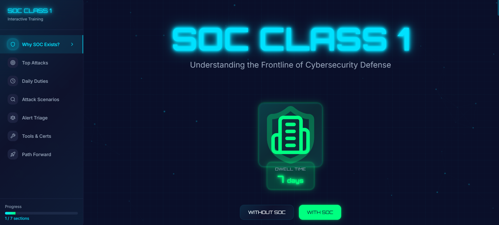

# Security Operations Center (SOC) Analyst L1 Guide

### Understanding the Frontline of Cybersecurity Defense

---

##  Overview

Welcome to the **SOC Analyst L1 Guide** – a comprehensive resource designed to help aspiring cybersecurity professionals understand the critical role of Security Operations Center analysts in modern threat detection and response.

This guide bridges the gap between theory and practice, offering real-world scenarios, actionable frameworks, and industry-standard methodologies that SOC analysts use daily to protect organizations from cyber threats.

##  Video Walkthrough

A complete video walkthrough of this guide, demonstrating real-world SOC operations, alert triage workflows, and SIEM analysis techniques.

**Video Topics Will Cover:**
- Live SIEM dashboard monitoring demonstration
- Step-by-step alert triage process
- Real attack scenario analysis
- Tool demonstrations (Splunk, EDR platforms)
- Career advice and practical tips

*Subscribe to stay updated when the video drops!*

---

##  What's Inside

This guide covers everything you need to know to start your journey as a SOC Analyst:

###  Core Concepts
- **Why SOC Exists** - Understanding the business impact and the cost of breaches
- **SOC vs NOC vs IR** - Clear distinctions between different security teams
- **The Dwell-Time Problem** - Why speed matters in threat detection

###  Top Attacks SOC Analysts Face
1. **Phishing Attacks** - Email gateway monitoring and detection techniques
2. **Brute Force Attempts** - Identifying login attack patterns
3. **Ransomware** - Recognizing mass encryption and backup deletion attempts

###  Daily SOC Operations
- Alert monitoring and triage workflows
- SIEM dashboard analysis
- Documentation and escalation procedures
- Collaboration with security teams

###  Attack Scenarios from Defender's Perspective
- **Phishing Attack Response** - From detection to containment
- **Malware Execution** - EDR alerts and IOC documentation
- **Ransomware Incident** - Time-critical response procedures
- **Brute Force Defense** - Account protection strategies

###  Alert Triage Framework
A systematic 4-step decision-making process:
1. **Initial Assessment** - Context gathering
2. **Log Analysis** - SIEM query techniques
3. **Context Gathering** - Threat intelligence integration
4. **Decision Making** - Escalate, close, or investigate further

###  Essential Tools & Technologies
- **SIEM Platforms**: Splunk, Microsoft Sentinel, IBM QRadar
- **EDR/XDR Solutions**: CrowdStrike Falcon, Microsoft Defender, Carbon Black
- **Threat Intelligence**: VirusTotal, AbuseIPDB, MITRE ATT&CK
- **Ticketing Systems**: ServiceNow, Jira

###  Certifications Roadmap
- **Entry Level**: CompTIA Security+
- **Practical Skills**: BTL1, CCD (Certified Cybersecurity Defender)
- **Tool-Specific**: Splunk Core Certified User, Microsoft SC-200

###  Career Path Guidance
- Building effective home labs
- Documentation best practices
- Developing a defender mindset

---

##  Interactive Learning Platform

> **Note:** The screenshots and examples throughout this guide are taken from an **interactive cybersecurity learning platform** currently under development. This project combines practical security knowledge with modern web development (MERN Stack) to create an engaging, hands-on learning experience.

**Features of the Platform (In Development):**
-  Real-time attack simulations
-  Interactive SIEM dashboards
-  Hands-on alert triage exercises
-  Progress tracking and skill assessments
-  Community-driven learning paths

 **Stay tuned!** The platform will be made publicly available once development is complete. Follow the links below to get notified about the launch.

---

##  How to Use This Guide

### Option 1: Download PDF
Download the complete PDF guide and read it offline:

### Option 2: Online Reading
View the guide directly in your browser through the repository.

### Option 3: Print Version
Optimized for printing - perfect for reference materials or study notes.

---

##  Who Is This Guide For?

 **Aspiring SOC Analysts** looking to break into cybersecurity  
 **IT Professionals** transitioning to security roles  
 **Students** pursuing cybersecurity education  
 **Security Enthusiasts** wanting to understand defensive operations  
 **Career Changers** exploring cybersecurity opportunities  

---

##  Key Takeaways

After completing this guide, you will understand:

-  The critical role SOC analysts play in organizational security
-  How to identify and respond to common cyber attacks
-  Systematic approaches to alert triage and investigation
-  Essential tools used in modern Security Operations Centers
-  Career pathways and certification recommendations
-  Practical skills needed for SOC analyst positions

---

##  About the Author

**Usama Sani Khanzada**

I'm an aspiring **SOC Analyst** and **Web Application Penetration Tester**, actively building expertise in both defensive and offensive security. My journey involves hands-on learning with SIEM platforms (Splunk, Wazuh), EDR solutions (CrowdStrike, SentinelOne), and pentesting tools like Burp Suite, Nmap, and Nessus.

I'm passionate about transforming security alerts into actionable insights and uncovering vulnerabilities through structured methodologies like the OWASP Top 10. My goal is to contribute meaningfully to organizations by bridging the gap between threat detection and secure application development.

###  Connect With Me

I regularly share insights, projects, and learning experiences. Let's connect and grow together in cybersecurity:

---

##  Star This Repository

If you found this guide helpful, please consider giving it a ⭐! It helps others discover this resource and motivates me to create more educational content.

---

##  Stay Updated

- **Follow me on [LinkedIn](https://www.linkedin.com/in/usama-sani-khanzada)** for regular cybersecurity insights
---

##  Additional Resources

### Recommended Learning Paths
- [Blue Team Labs Online](https://blueteamlabs.online/)
- [TryHackMe SOC Level 1 Path](https://tryhackme.com/)
- [LetsDefend](https://letsdefend.io/)
- [CyberDefenders](https://cyberdefenders.org/)

### Essential Reading
- MITRE ATT&CK Framework
- SANS SOC Survey Reports
- Verizon Data Breach Investigations Report (DBIR)

### Communities
- r/cybersecurity
- r/AskNetsec
- BlueTeamVillage Discord

---

##  Acknowledgments

- Thanks to the cybersecurity community for continuous knowledge sharing
- Inspired by real-world SOC operations and industry best practices
- Special appreciation to all aspiring defenders working to make cyberspace safer

---

##  Project Status

 **Interactive Platform** - Under development, launching soon  

---

###  Defend. Detect. Respond. 

*"In cybersecurity, every second counts. Every alert matters. Every defender makes a difference."*

---

 **Star this repo** |  **Share with others** |  **Let's connect**

