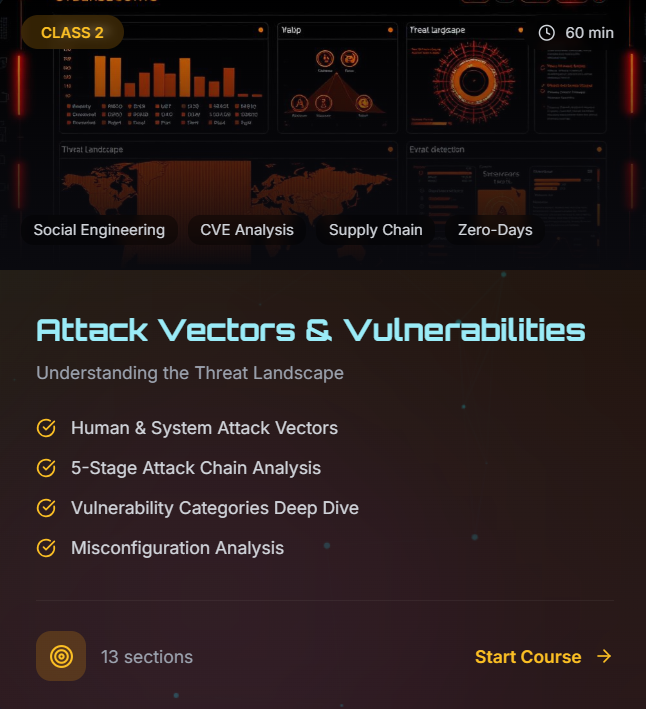
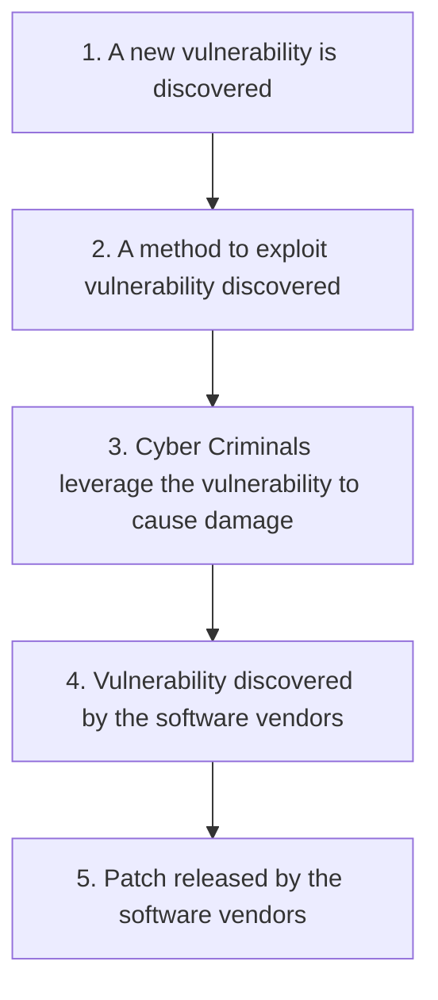

# Human & System as Attack Vectors in SOC


---

## Video Walkthrough

A complete video walkthrough of this guide, demonstrating real-world SOC operations, alert triage workflows, and SIEM analysis techniques.

[](https://drive.google.com/file/d/1GL-ZyvxqNtDpn8ApfUyAt80Hlv2UZd0s/view?usp=sharing)

---

## Human Attack Vectors in SOC

Not every organization has the expertise to operate a SOC on its own and relies on a **Managed Security Services Provider (MSSP)**, a company that delivers outsourced security services, most commonly SOC, to its clients. Working at MSSP is typically high-pressure, but it is also a good option to QuickStart your career.

### Why are Humans Targeted?

Humans are targeted because of the access they can provide to websites, mailboxes, or databases. Some threat actors hunt for specific access, while others are not so selective and just breach as many accounts as they can and decide how to use them later.

Attacks targeting humans share a common trait: they rely on manipulating the victim into helping the attacker, whether knowingly or not. This tactic is known as **social engineering**, and it works by exploiting human psychology rather than technical flaws.

For a tactic to succeed, it is designed to be:

| Characteristic | Description |
|----------------|-------------|
| **Trustworthy** | The attacker must appear legitimate, so the victim trusts them |
| **Emotional** | The attack must trigger feelings like urgency, fear, or curiosity |

### Humans Can Be Targeted Using:

- Phishing attacks
- Malware Downloads
- Deep fakes
- Impersonation
- Other Attacks (keylogging, Physical Attack, etc.)

### How To Defend Humans?

Defending against threats involves two key tasks: **Mitigation** and **Detection**. Mitigation aims to prevent or reduce the chance and impact of attacks, for example by training employees or deploying a good anti-phishing solution.

As a SOC Analyst, your task is to **detect and investigate attacks**, because after some time you will be tired of manual mitigation & will want an automated way—and there comes the SOC suite of automated solutions.

**Defense Solutions:**
- Anti-phishing solution
- Antivirus / EDR solution
- "Trust but verify" principle
- Security awareness training

---

## System Attack Vectors & Vulnerabilities

### System as Attack Vectors

In SOC, we don't just protect users or data—we protect **SYSTEMS**, because every system can be abused as an Attack vector.

```
1. Gain Initial Access
2. Move Laterally
3. Maintain Persistence
4. Exfiltrate Data
5. Launch Further Attacks
```

---

## Human Oriented Attacks

Users are those who started the attack mostly: *(Before external factors, Users are responsible at first)*

By inserting a malicious USB found on a street, downloading malware from pirated resources, or simply reusing a weak password everywhere.

> **81% of breaches involve stolen or breached passwords.**

### Examples:
- Rubber Ducky
- Keyloggers binded with legitimate software
- Clicking on suspicious links
- Opening any email or sent attachments
- Storing passwords at unsecure portals
- Trusting too soon
- Using outdated / pirated software

---

## Supply Chain Attacks

Your PC is home to hundreds of apps, including web browsers, messengers, development, and entertainment software. Every app depends on thousands of libraries.

If threat actors manage to breach one of the apps or libraries and push an update to all its users, **all of them will be compromised**. This technique is called a **supply chain attack**.

> **Famous Examples:** The SolarWinds and 3CX breaches which affected thousands of companies.

It is hard to protect from supply chain attacks since you can't always control all the software present on your laptops, servers, and web apps.

---

## Vulnerabilities

Every piece of software has security flaws.

> **In 2024, over 40,000 software vulnerabilities were published and more than 300 were actively exploited in major attacks.**

**Vulnerability** is a weakness in a system, software, hardware, or process that can be exploited by an attacker to:
- Gain access
- Escalate privileges
- Execute code
- Steal data
- Disrupt services
- And more...

---

### Software Vulnerabilities

Every piece of software has flaws, but some take years to discover. For example, **Shellshock**, a major Linux vulnerability, existed since 1992 but wasn't found until 2014.

In the worst-case scenario, an attacker discovers the vulnerability before anyone else. This is known as a **zero-day**, and only your SOC skills can determine whether it gets detected in time.

Once a vulnerability is made public, it is assigned a **Common Vulnerabilities and Exposure (CVE)** number. From that moment, it's a race: attackers develop exploits while defenders rush to update their systems.

**An answer to a CVE is always a patch** — an update supplied by the software vendor. Even for zero-days, you'll have to wait for a patch, vigilantly monitor for exploitation traces, and try to secure during this stressful period.

**Temporary Measures:**
- Restricting access to the system to only trusted IPs
- Applying temporary measures provided by the vendor
- Blocking known attack patterns on IPS or WAF

**Examples of Software Vulnerabilities:**
| Vulnerability | Description |
|---------------|-------------|
| SQL Injection | Injecting malicious SQL queries |
| Command Injection | Executing arbitrary system commands |
| Buffer Overflow | Overwriting memory boundaries |
| Cross-site Scripting (XSS) | Injecting malicious scripts |
| Remote Code Execution (RCE) | Executing code remotely |

**SOC Detection:**
- WAF alerts
- Web server logs
- Unusual POST requests
- EDR alerts on servers

---

### Operating System Vulnerabilities

**Examples:**
- Windows Vulnerabilities
- Linux Vulnerabilities
- Mac OS kernels or services Vulnerabilities
- Privilege escalation bugs
- SMB vulnerabilities (EternalBlue)
- Kernel exploits

**SOC Detection:**
- Sudden privilege change
- Exploit behavior in EDR
- Kernel driver loading alerts

---

### Network Vulnerabilities

**Examples:**
- Open ports
- Weak Protocols (Telnet, FTP)
- Unpatched routers / Firewalls
- Exposed admin interfaces

**SOC Detection:**
- IDS/IPS alerts
- Firewall logs
- Excessive authentication failures

---

### Authentication and Authorization Vulnerabilities

**Examples:**
- Weak passwords
- No MFA
- Broken access control
- Privilege escalation paths

**SOC Detection:**
- IAM alerts
- Access logs
- Role change events

---

### Configuration-Dependent Vulnerabilities

**Examples:**
- Debug modes enabled
- Default Credentials
- Excessive permissions

**SOC Detection:**
- Admin panel exposed
- Default credentials unchanged
- System takeover

---

## Zero-Day Vulnerabilities

A vulnerability for which a patch does not exist yet as it is unknown to the vendor and is used by malicious actors like hackers.

**SOC Detection:**
- Abnormal processes
- Suspicious network traffic
- Lateral movement

### Life Cycle of Zero-Day Vulnerability



### Life Cycle of Zero-Day Attack

1. **Release:** A software program with an inherent security weakness or flaw is released. This defect is unknown to developers at the time of launch.
2. **Discovery:** An attacker discovers the vulnerability in the software program.
3. **Exploitation:** The attacker takes advantage of the vulnerability and releases malware into the software through social engineering techniques or phishing.
4. **Attack:** The attacker uses this opportunity to steal data from the infected system or may install spyware or a backdoor to enable future attacks.
5. **Mitigation:** Once the attack is launched, the developers detect it and create a patch to mitigate it.

---

## Common Misconfigurations for SOC

> **Most breaches don't happen because of zero-days — they happen because of misconfigurations and unpatched vulnerabilities.**

Misconfiguration isn't a bug in the software but a mistake in how the system was set up, often by the IT team. These errors happen frequently, usually to make things simpler.

### Cloud Misconfigurations

**Examples:**
- Public S3 buckets
- Open Azure Blob Storage
- Over-permissive IAM roles
- Exposed access keys

**SOC Example:**
```
S3 bucket public → Sensitive data indexed by search engines → Data breach
```

**Common Cloud Attack Vectors:**
- Human errors
- Unmanaged Attack Surface
- Insufficient Access Management
- Misconfigured Cloud Storage
- Shared Technology weakness
- Insider threats

---

### Network Misconfigurations

**Examples:**
- Firewalls allow all traffic
- Internal services exposed externally
- No network segmentation (All devices on same network)

**SOC Example:**
```
Internal DB port exposed → External scan finds it → Database accessed
```

---

### Identity Misconfigurations

**Examples:**
- MFA Disabled for admins
- Excessive group memberships
- Shared admin accounts

**SOC Example:**
```
Compromised User → User already has admin privilege → No escalation needed
```

---

### Endpoint Misconfigurations

**Examples:**
- Antivirus disabled
- Local admin access
- USB allowed everywhere

**SOC Example:**
```
Malware executed → No EDR → Persistence Established
```

---

## Major System Categories Used as Attack Vectors

### What are Endpoints?

- Laptops
- Desktops
- VDI (Virtual Desktop Infrastructure)
- Workstations

**How attackers use them:**
- Phishing email → malicious attachment
- Drive-by downloads
- USB-based malware
- Exploiting unpatched software

**Why are Endpoints dangerous?**
- Users have access
- Users click things
- Often the weakest security point

### What is Endpoint Security?

The policies, processes, and technology controls used to protect the **Confidentiality, Integrity, and Availability** of an endpoint system.

**Endpoint Security Components:**
| Component | Description |
|-----------|-------------|
| Anti-malware | Protection against malicious software |
| Endpoint Security Control | Device-level security measures |
| Data Security | Protecting sensitive data |
| Application Security | Securing applications |
| IAM | Identity and Access Management |
| Acceptable Use Policies | Guidelines for proper usage |
| Configuration Management | Maintaining secure configurations |
| System Monitoring | Continuous surveillance |

---

### Servers (Application/Database/File)

**Types:**
- Web server
- App server
- DB server
- File server

**How attackers abuse servers:**
- Exploiting vulnerabilities
- Log4j exploitation
- SQL Injection
- RCE Vulnerabilities
- Weak admin credentials
- Exposed Services

**Why servers are high value:**
- Run Critical apps
- Store Sensitive Data
- Often Trusted Internally

---

### Network Devices (Routers, Firewalls, VPNs)

**Devices:**
- Routers
- Firewalls
- VPN Gateways
- Load balancers

**How attackers abuse them:**
- Default Credentials
- VPN vulnerabilities
- Misconfigured Firewalls
- Firmware exploits

### Real-World Attack Chain Example:

```
Initial Access: Compromised VPN Accounts
    ↓
Credential Access: Utilizing DCSync and SECRETSDUMP to harvest credentials
    ↓
Defense Evasion: Files staged in directories (C:\ProgramData and C:\SystemTest)
    ↓
Discovery: Use of netapp.exe (a variant of netscan)
    ↓
Privilege Escalation: Exploiting CVE-2020-1472 (Zerologon) to create admin accounts
    ↓
Lateral Movement: The use of WMIC.exe
    ↓
Execution, Persistence & C&C: The abuse of AnyDesk.exe
```

---

### Cloud Systems (Azure, AWS, GCP)

**Common Cloud Attack Vectors:**
- Public S3 buckets
- Exposed access keys
- Over-permissive IAM Roles
- Metadata service abuse
- Human errors
- Unmanaged Attack Surface
- Insufficient Access Management
- Misconfigured Cloud Storage
- Shared Technology weakness
- Insider threats

---

## About the Author

**Usama Sani Khanzada**

I'm an aspiring **SOC Analyst** and **Web Application Penetration Tester**, actively building my expertise in both defensive and offensive security. My journey involves hands-on learning with SIEM platforms (Splunk, Wazuh), EDR solutions (CrowdStrike, SentinelOne), and pentesting tools like Burp Suite, Nmap, and Nessus.

I'm passionate about transforming security alerts into actionable insights and uncovering vulnerabilities through structured methodologies like the OWASP Top 10. My goal is to contribute meaningfully to organizations by bridging the gap between threat detection and secure application development.

### Let's Connect

I regularly share insights, projects, and learning experiences on my professional platforms. Follow my journey and feel free to connect:

[](https://www.linkedin.com/in/usama-sani-khanzada)
[](https://github.com/usamasani)

Your feedback, collaboration ideas, and questions are always welcome. Let's learn and grow together in the ever-evolving field of cybersecurity!

---

<div align="center">

### Defend. Detect. Respond.

*"In cybersecurity, every second counts. Every alert matters. Every defender makes a difference."*

---

**Star this repo** | **Share with others** | **Let's connect**

</div>
